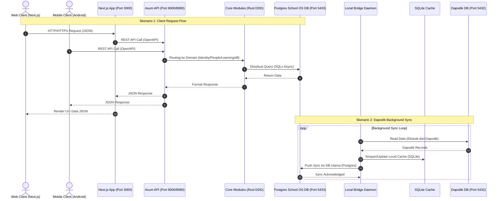
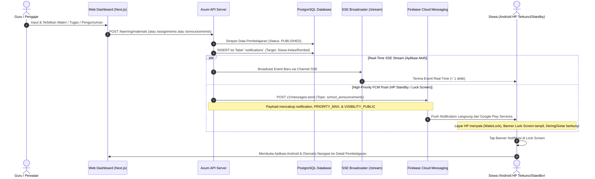

# Spesifikasi Arsitektur Sistem School OS

Dokumen ini menyajikan arsitektur sistem secara menyeluruh, terperinci, dan komprehensif untuk **School OS**. Dokumen ini mencakup prinsip arsitektur (ADR), struktur folder mendalam, *tech stack*, diagram alur kerja (*sequence & dataflow*), serta rincian fungsionalitas di setiap modul berdasarkan kondisi aktual proyek.

---

## 1. Prinsip & Keputusan Arsitektur (Architectural Decision Records / ADR)

Sistem School OS dibangun di atas prinsip-prinsip arsitektur modern untuk menjamin kemudahan pemeliharaan, keamanan, performa tinggi, serta isolasi data:

1. **Clean Architecture (ADR-0001):** Pemisahan lapisan yang ketat antara *Presentation* (HTTP/Axum), *Domain/Business Logic* (`school-core`), dan *Infrastructure* (Database/SQLx, FCM, Smart Reminder, & Observability).
2. **Domain-Driven Design / DDD (ADR-0002):** Pengelompokan logika berdasarkan konteks terisolasi (*Bounded Contexts*) seperti `identity`, `academic`, `learning`, `people`, `communication`, dan `reporting`.
3. **Event-Driven Architecture (ADR-0003):** Penggunaan pola *Outbox Event* (`outbox_events`) untuk menangani sinkronisasi eksternal/internal secara asinkron tanpa memblokir transaksi database utama.
4. **Multi-Tenant Schema & Isolation (ADR-0004):** Sistem mendukung multi-sekolah/tenant dengan identifikasi tenant terisolasi (termasuk penanganan NPSN unik sekolah).
5. **UUID v7 (ADR-0005):** Penggunaan Primary Key bertipe UUID v7 yang *time-sortable* untuk mengoptimalkan performa indeks B-Tree pada PostgreSQL dan SQLite.
6. **Frontend Feature-Sliced Design / FSD (ADR-0006):** Pengorganisasian kode *frontend* berdasarkan fitur (`features/`) dan lapisan teratur (`app`, `widgets`, `components`, `shared`, `lib`).
7. **Assessment Domain Decoupling (ADR-0007):** Pemisahan mesin penilaian (*assessment & quiz*) dari logika akademik umum agar dapat dikembangkan dan diuji secara independen.

---

## 2. Tech Stack Lengkap

| Lapisan / Komponen | Teknologi | Keterangan & Penggunaan |
| :--- | :--- | :--- |
| **Web Frontend** | **Next.js 16 (React 19)** | Framework React modern dengan App Router, Server Components, & SSR |
| | **TypeScript 5.9** | Type safety mutlak di seluruh basis kode *frontend* |
| | **React Query (@tanstack)** | Caching, async state management, dan automatic background re-fetching |
| | **React Hook Form & Zod** | Manajemen formulir interaktif & validasi skema runtime |
| | **@hey-api/openapi-ts** | Autogenerasi Klien API TypeScript dari OpenAPI endpoint Rust server |
| | **Pure CSS & CSS Modules** | Design System fleksibel berbasis CSS Native Variables tanpa overhead utility library |
| | **Vitest & Testing Library** | Unit testing & Component testing di frontend |
| **Backend Core** | **Rust (Edition 2024)** | Bahasa pemrograman utama backend (Performa tinggi, memory safety, tanpa GC) |
| | **Axum 0.8** | Web framework asinkron performa tinggi berbasis Tower & Hyper |
| | **Tokio 1.52** | Asynchronous runtime multi-threaded untuk penanganan I/O tinggi |
| | **SQLx 0.7** | Pure Rust Async SQL crate dengan compile-time query validation |
| | **Utoipa 5.5** | Auto-generator dokumentasi OpenAPI / Swagger UI interaktif di Rust |
| | **Argon2 & JWT** | Autentikasi aman berbasis standar industri dengan enkripsi password kuat |
| **Notifikasi & Real-Time** | **Firebase Cloud Messaging (HTTP v1)** | Push notification prioritas tinggi dengan integrasi Lock Screen banner & WakeLock |
| | **Server-Sent Events (SSE)** | Kanal streaming real-time berlatensi rendah (< 1s) untuk pengumuman & broadcast |
| | **Smart Reminder Worker** | Worker penjadwalan cerdas pengingat jam mengajar & materi otomatis (Quiet Hours) |
| **Local Bridge Agent** | **Rust & Tokio** | Daemon latar belakang independen untuk komunikasi Dapodik |
| | **SQLite & PostgreSQL** | Cache data lokal & koneksi langsung ke Dapodik DB lokal |
| | **Reqwest & Keyring** | Komunikasi HTTPS aman & penyimpanan rahasia OS (Windows Credential Manager / Keychain) |
| **Mobile App** | **Kotlin & Android SDK (API 26-35)** | Aplikasi Native Android dengan Clean Architecture & Jetpack Compose |
| | **CameraX** | Pemindaian QR Code untuk otentikasi login instan |
| **Database & Infrastructure** | **PostgreSQL 15 Alpine** | Database Relasional Utama dengan 58 file migrasi terstruktur |
| | **Docker & Docker Compose** | Containerization environment lokal & production staging |
| | **Isolated Port (5433)** | Mengisolasi DB School OS dari port default 5432 milik Dapodik sekolah |

---

## 3. Diagram Alur Kerja (Workflow Diagrams)

### A. High-Level System Architecture Diagram



---

### B. Siklus Penerbitan Pembelajaran & Notifikasi (*Teacher Publish Flow*)



---

### C. Dapodik Sync Engine Workflow (Local Bridge)


---

## 4. Rincian Fungsionalitas Modul Utama

1. **Identity & Access Management (IAM / Multi-Tenancy):**
   - Mendukung multi-sekolah dengan data *tenant* terisolasi dan verifikasi NPSN.
   - Manajemen peran terperinci (*Role-Based Access Control / RBAC*) untuk Admin Sekolah, Kepala Sekolah, Operator Dapodik, Guru, Siswa, dan Orang Tua.
   - Fitur Token Refresh, Session Guard, proteksi mode pemeliharaan (*Maintenance Mode*), dan login instan dengan pemindaian QR Code (`CameraX`).

2. **Manajemen Akademik & Data Utama (People & Academic):**
   - Pengelolaan data Guru, Siswa, Tenaga Kependidikan, dan Wali Murid.
   - Struktur Tingkat Kelas, Rombongan Belajar (Rombel), Mata Pelajaran, Tahun Ajaran, dan slot jadwal mingguan (`class_schedules`).

3. **Mesin Pembelajaran & Evaluasi (Learning & Assessment Engine):**
   - **Materi & Silabus:** Manajemen modul ajar, video pembelajaran, silabus, dan pelacakan status selesai baca siswa (`student_material_completions`).
   - **Tugas Terstruktur (Assignments):** Pembuatan tugas berstruktur soal pilihan ganda dan esai dengan rubrik penilaian, batas waktu pengumpulan, riwayat *submission attempts*, dan penilaian guru.
   - **Ujian CBT (Quizzes):** Mesin kuis interaktif dengan timer mundur, acak soal, pencegahan kecurangan, dan penilaian skor otomatis.
   - **Perpustakaan Digital SIBI Kemdikdasmen:** Katalog buku kurikulum nasional Kurikulum Merdeka terverifikasi resmi Kemdikdasmen untuk Siswa dan Guru dengan pembaca PDF terintegrasi dan pelacakan progres membaca.
   - **Tanya Guru (Inquiries):** Forum tanya-jawab dan konsultasi privat interaktif antara siswa dan guru mata pelajaran.
   - **Gamifikasi (Achievements):** Sistem lencana prestasi untuk mengapresiasi keaktifan dan capaian siswa.

4. **Sistem Notifikasi Multi-Saluran & Smart Reminder:**
   - **Firebase Cloud Messaging (FCM HTTP v1):** Push notification berprioritas tinggi (`PRIORITY_MAX`) dengan channel `school_os_announcements_v3` dan visibilitas publik di Lock Screen (`VISIBILITY_PUBLIC`) disertai WakeLock yang menyalakan layar HP saat standby.
   - **Server-Sent Events (SSE Stream):** Kanal streaming real-time berlatensi rendah (< 1 detik) untuk pengumuman dan broadcast sekolah saat aplikasi aktif.
   - **Smart In-App Deduplication:** Eliminasi duplikasi banner antar-saluran notifikasi dalam jendela waktu 60 detik.
   - **Smart Reminder Worker:** Pengingat jam mengajar otomatis 15 menit sebelum kelas dimulai dengan kepatuhan jam tenang (*Quiet Hours* 21:00 - 06:00 WIB).

5. **Engine Integrasi Dapodik (Local Bridge Daemon):**
   - Bekerja di latar belakang tanpa mengganggu kinerja komputer sekolah.
   - Menghubungkan database Dapodik (port default 5432) ke sistem School OS (port 5433) secara aman dan tersetruktur.
   - Menyediakan fitur *conflict resolution* jika terdapat perbedaan data antara Dapodik dan School OS.

6. **Portal Pengguna Spesifik:**
   - **Dashboard Manajemen (Web):** 19 modul operasional untuk Admin, Operator, dan Guru dalam mengelola KBM, ujian CBT, absensi, dan penilaian.
   - **Portal Orang Tua (Parent Portal):** Antarmuka web ramah pengguna bagi wali murid untuk memantau kehadiran, nilai, dan pengumuman sekolah anak secara *real-time*.
   - **Portal Super Admin (`/system-admin`):** Kontrol multi-tenant dan pengaturan maintenance mode global.
   - **Aplikasi Mobile Android Native:** 11 modul fitur berbasis Jetpack Compose untuk akses cepat dari smartphone.

7. **Audit Trail & Idempotency:**
   - Setiap operasi sensitif dicatat ke dalam `audit_logs` untuk kebutuhan transparansi dan keamanan.
   - Penggunaan `idempotency_keys` untuk mencegah terjadinya duplikasi transaksi atau data saat terjadi gangguan jaringan.

---

## 5. Contoh Penggunaan API & Integrasi

### A. Otentikasi Pengguna (Login)
**Request:**
```bash
curl -X POST http://localhost:8000/api/v1/auth/login \
  -H "Content-Type: application/json" \
  -d '{
    "username": "guru.matematika@sekolah.id",
    "password": "PasswordKuat123!"
  }'
```

### B. Menerbitkan Pengumuman Sekolah & Broadcast Real-Time
**Request:**
```bash
curl -X POST http://localhost:8000/api/v1/announcements \
  -H "Authorization: Bearer <TOKEN>" \
  -H "Content-Type: application/json" \
  -d '{
    "title": "Jadwal Ujian Tengah Semester Genap",
    "content": "Pelaksanaan UTS dimulai Senin depan. Harap seluruh siswa mempersiapkan diri.",
    "category": "AKADEMIK",
    "target": "TARGET_ALL",
    "send_push": true
  }'
```

### C. Pengumpulan Tugas Siswa (Assignment Submission)
**Request:**
```bash
curl -X POST http://localhost:8000/api/v1/learning/assignments/018e3a2b-asg1/submit \
  -H "Authorization: Bearer <TOKEN>" \
  -H "Content-Type: application/json" \
  -d '{
    "student_id": "018e3a2b-std1",
    "notes": "Pengumpulan tugas praktikum pemrograman.",
    "file_url": "https://storage.schoolos.id/uploads/tugas_01.pdf"
  }'
```

---
*Dokumen arsitektur ini diperbarui secara berkala dan merefleksikan seluruh kode program, skema database, serta struktur modul aktif di dalam repositori School OS.*
