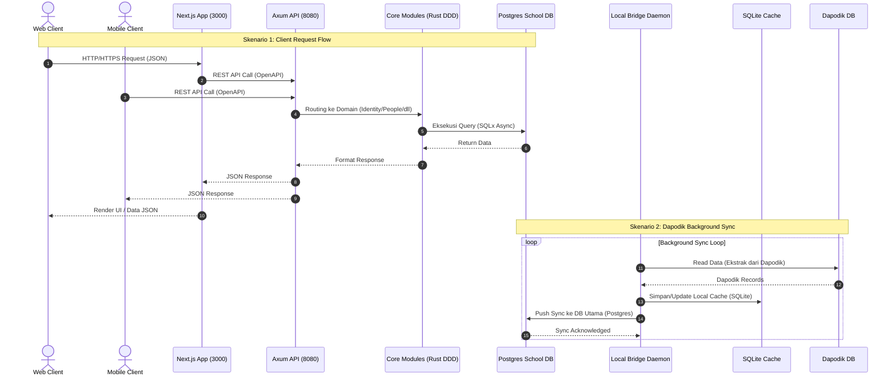
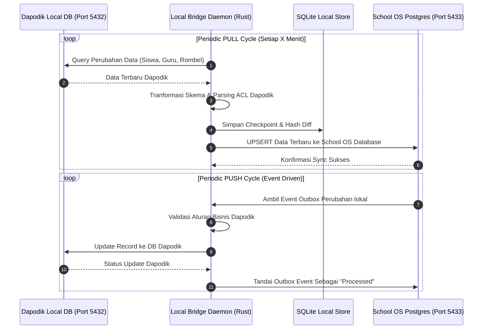

# Spesifikasi Arsitektur Sistem School OS

Dokumen ini menyajikan arsitektur sistem secara menyeluruh, terperinci, dan komprehensif untuk **School OS**. Dokumen ini mencakup prinsip arsitektur (ADR), struktur folder mendalam, *tech stack*, diagram alur kerja (*sequence & dataflow*), serta rincian fungsionalitas di setiap modul.

## 1. Prinsip & Keputusan Arsitektur (Architectural Decision Records / ADR)
Sistem School OS dibangun di atas prinsip-prinsip arsitektur modern untuk menjamin kemudahan pemeliharaan, keamanan, performa tinggi, serta isolasi data:

1. **Clean Architecture (ADR-0001):** Pemisahan lapisan yang ketat antara *Presentation* (HTTP/Axum), *Domain/Business Logic* (`school-core`), dan *Infrastructure* (Database/SQLx & Observability).
2. **Domain-Driven Design / DDD (ADR-0002):** Pengelompokan logika berdasarkan konteks terisolasi (*Bounded Contexts*) seperti `identity`, `academic`, `learning`, `people`, dan `reporting`.
3. **Event-Driven Architecture (ADR-0003):** Penggunaan pola *Outbox Event* (`outbox_events`) untuk menangani event eksternal/internal secara asinkron tanpa memblokir transaksi database utama.
4. **Multi-Tenant Schema & Isolation (ADR-0004):** Sistem mendukung multi-sekolah/tenant dengan identifikasi tenant terisolasi (termasuk penanganan NPSN sekolah).
5. **UUID v7 (ADR-0005):** Penggunaan Primary Key bertipe UUID v7 yang *time-sortable* untuk mengoptimalkan performa indeks B-Tree pada PostgreSQL dan SQLite.
6. **Frontend Feature-Sliced Design / FSD (ADR-0006):** Pengorganisasian kode *frontend* berdasarkan fitur (`features/`) dan lapisan teratur (`app`, `widgets`, `components`, `shared`, `lib`).
7. **Assessment Domain Decoupling (ADR-0007):** Pemisahan mesin penilaian (*assessment & quiz*) dari logika akademik umum agar dapat dikembangkan dan diuji secara independen.
---
## 2. Tech Stack Lengkap

| Lapisan / Komponen | Teknologi | Keterangan & Penggunaan |
| :--- | :--- | :--- |
| **Web Frontend** | **Next.js 16 (React 19)** | Framework React dengan App Router, SSR, dan Server Components |
| | **TypeScript 5.9** | Type safety di seluruh basis kode *frontend* |
| | **React Query (@tanstack)** | Caching, async state management, dan automatic re-fetching |
| | **React Hook Form & Zod** | Manajemen formulir & validasi skema runtime |
| | **@hey-api/openapi-ts** | Autogenerasi Klien API Typescript dari OpenAPI Rust server |
| | **Vanilla CSS & Modules** | Design System tanpa overhead Tailwind, menggunakan CSS Native Variables |
| | **Vitest & Testing Library** | Unit testing & Component testing di frontend |
| **Backend Core** | **Rust (Edition 2024)** | Bahasa pemrograman utama backend (Performa tinggi, memory safety) |
| | **Axum 0.8** | Web framework asinkron performa tinggi |
| | **Tokio 1.52** | Asynchronous runtime untuk penanganan I/O |
| | **SQLx 0.7** | Pure Rust Async SQL crate dengan compile-time query check |
| | **Utoipa 5.5** | Auto-generator dokumentasi OpenAPI / Swagger UI di Rust |
| | **JSONWebToken & Argon2** | Autentikasi berstandar industri & hashing kredensial aman |
| **Local Bridge Agent** | **Rust & Tokio** | Daemon latar belakang independen |
| | **SQLite & PostgreSQL** | Cache data lokal & koneksi langsung ke Dapodik DB |
| | **Reqwest & Keyring** | Komunikasi HTTP HTTPS aman & penyimpanan rahasia OS (Windows Credential Manager / Keychain) |
| **Mobile App** | **Kotlin & Android SDK** | Aplikasi Native Android |
| | **Jetpack Compose** | Modern Declarative UI Framework di Android |
| **Database & Infrastructure** | **PostgreSQL 15 Alpine** | Database Relasional Utama |
| | **Docker & Docker Compose** | Containerization environment lokal & staging |
| | **Isolated Port (5433)** | Mengisolasi DB School OS dari port default 5432 milik Dapodik |
---

## 3. Diagram Alur Kerja (Workflow Diagrams)

### A. High-Level System Architecture Diagram



### B. Dapodik Sync Engine Workflow (Local Bridge)



## 4. Rincian Fungsionalitas Modul Utama

1. **Identity & Access Management (IAM / Multi-Tenancy):**
   - Mendukung multi-sekolah dengan data *tenant* terisolasi.
   - Manajemen peran terperinci (*Role-Based Access Control / RBAC*) untuk Admin Sekolah, Guru, Siswa, dan Orang Tua.
   - Fitur Token Refresh, Session Guard, serta dukungan penanganan NPSN (Nomor Pokok Sekolah Nasional).

2. **Manajemen Akademik & Data Utama (People & Academic):**
   - Pengelolaan data Guru, Siswa, Tenaga Kependidikan, dan Wali Murid.
   - Struktur Tingkat Kelas, Rombongan Belajar (Rombel), Mata Pelajaran, dan Tahun Ajaran.

3. **Mesin Pembelajaran & Evaluasi (Learning & Assessment Engine):**
   - **Materi & Silabus:** Manajemen modul ajar, dokumen pembelajaran, dan silabus.
   - **Tugas (Assignments):** Pembuatan tugas, pengumpulan berkas (*submissions*), dan penilaiaan guru.
   - **Kuis (Quizzes):** Pembuatan soal kuis, pembatasan waktu, serta penilaian otomatis.
   - **Tracking Progress:** Pemantauan kemajuan belajar siswa secara visual.

4. **Engine Integrasi Dapodik (Local Bridge Daemon):**
   - Bekerja di latar belakang tanpa mengganggu kinerja komputer sekolah.
   - Menghubungkan database Dapodik (yang umumnya terkunci di port 5432) ke sistem School OS secara aman dan tersetruktur.
   - Menyediakan fitur *conflict resolution* jika terdapat perbedaan data antara Dapodik dan School OS.

5. **Portal Pengguna Spesifik:**
   - **Dashboard Manajemen:** Digunakan oleh Admin dan Guru untuk mengelola kegiatan belajar mengajar, absensi, dan penilaian.
   - **Portal Orang Tua (Parent Portal):** Antarmuka khusus bagi orang tua untuk memantau kehadiran, nilai, dan pengumuman sekolah anak secara *real-time*.
   - **Aplikasi Mobile Android:** Ekosistem mobile berbasis Kotlin untuk akses fleksibel dari smartphone.

6. **Audit Trail & Idempotency:**
   - Setiap operasi sensitif dicatat ke dalam `audit_logs` untuk kebutuhan transparansi dan keamanan.
   - Penggunaan `idempotency_keys` untuk mencegah terjadinya duplikasi transaksi atau data saat terjadi gangguan jaringan.

## 5. Dokumentasi API, Autentikasi, & Observabilitas

### 5.1. Postman Collection Siap Pakai
Tersedia collection Postman v2.1 siap pakai dengan auto-capture JWT Bearer token:
- **Collection**: [`docs/api-contract/School_OS_API.postman_collection.json`](docs/api-contract/School_OS_API.postman_collection.json)
- **Environment**: [`docs/api-contract/School_OS.postman_environment.json`](docs/api-contract/School_OS.postman_environment.json)

Impor kedua file tersebut ke Postman, pilih environment *School OS — Local Environment*, lalu jalankan request *Login*. Variabel `jwt_token` akan tersimpan secara otomatis untuk seluruh request berikutnya.

### 5.2. Alur Autentikasi (Authentication Flow)
Dokumentasi lengkap alur otentikasi JWT dan QR Login Siswa beserta diagram Mermaid dapat dibaca di:
👉 [**Dokumentasi Lengkap Alur Autentikasi (AUTH_FLOW.md)**](docs/api-contract/AUTH_FLOW.md)

### 5.3. Contoh Request & Response API

#### A. Autentikasi (Login User)
**Request:**
```bash
curl -X POST http://localhost:8080/api/v1/auth/login \
  -H "Content-Type: application/json" \
  -H "x-tenant-id: 018e3a2b-1234-7a11-89bc-99a8b7c6d5e4" \
  -d '{
    "username": "admin@school.id",
    "password": "Password123!"
  }'
```

**Response (200 OK):**
```json
{
  "status": "success",
  "data": {
    "access_token": "eyJhbGciOiJIUzI1NiIsInR5cCI6IkpXVCJ9...",
    "token_type": "Bearer",
    "expires_at": 1772966400,
    "user": {
      "id": "018e3a2b-9281-7f61-b752-19e49c71a39f",
      "username": "admin@school.id",
      "name": "Budi Santoso, S.Pd",
      "role": "school_admin",
      "tenant_id": "018e3a2b-1234-7a11-89bc-99a8b7c6d5e4"
    }
  }
}
```

#### B. Quick Login Siswa via QR Token
**Request:**
```bash
curl -X POST http://localhost:8080/api/v1/auth/qr-login \
  -H "Content-Type: application/json" \
  -d '{
    "qr_token": "qr_sec_tok_example_student_01"
  }'
```

#### C. Pengambilan Profil Sekolah
**Request:**
```bash
curl -X GET http://localhost:8080/api/v1/schools/profile \
  -H "Authorization: Bearer <TOKEN>" \
  -H "x-tenant-id: 018e3a2b-1234-7a11-89bc-99a8b7c6d5e4"
```

**Response (200 OK):**
```json
{
  "status": "success",
  "data": {
    "id": "018e3a2b-1234-7a11-89bc-99a8b7c6d5e4",
    "npsn": "20104050",
    "name": "SMK Bintang Bangsa",
    "address": "Jl. Pendidikan Nasional No. 10",
    "status": "active"
  }
}
```

#### D. Pengumpulan Tugas Siswa (Assignment Submission)
**Request:**
```bash
curl -X POST http://localhost:8080/api/v1/learning/assignments/018e3a2b-asg1/submissions \
  -H "Authorization: Bearer <TOKEN>" \
  -H "Content-Type: application/json" \
  -d '{
    "student_id": "018e3a2b-std1",
    "content": "Pengumpulan tugas mandiri praktikum pemrograman.",
    "file_url": "https://storage.schoolos.id/uploads/tugas_01.pdf"
  }'
```

### 5.4. Monitoring & Observabilitas (Prometheus, Grafana, Jaeger, Alertmanager)
School OS dilengkapi dengan monitoring performa tinggi:
- **Metrics**: Endpoint `/metrics` (Prometheus format) diakses di port 8080.
- **Grafana Dashboard**: Port `3001` ([http://localhost:3001](http://localhost:3001) user/pass: `admin`/`admin`).
- **Distributed Tracing**: Port `16686` ([http://localhost:16686](http://localhost:16686) Jaeger UI).
- **Alertmanager**: Port `9093` dengan integrasi notifikasi Telegram dan Email.

Jalankan seluruh stack observabilitas:
```bash
docker compose up -d
```
Panduan lengkap alert konfigurasi: [`observability/README.md`](observability/README.md).

---
*Dokumen arsitektur ini diperbarui secara berkala dan merefleksikan kode program serta struktur direktori aktif di dalam repositori School OS.*
