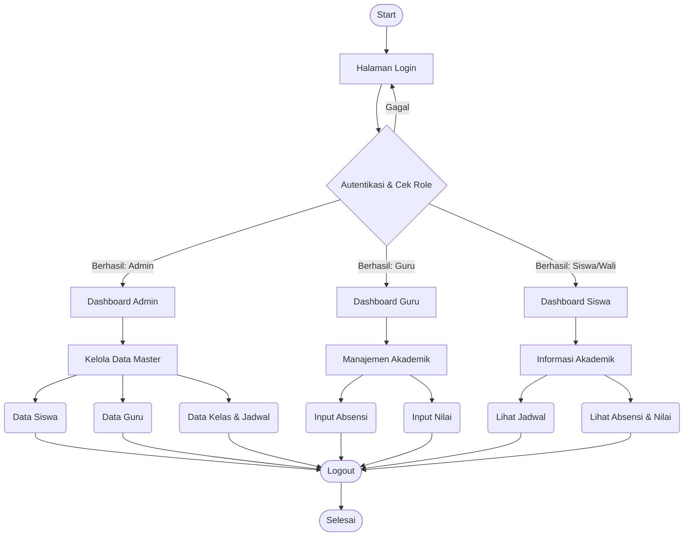
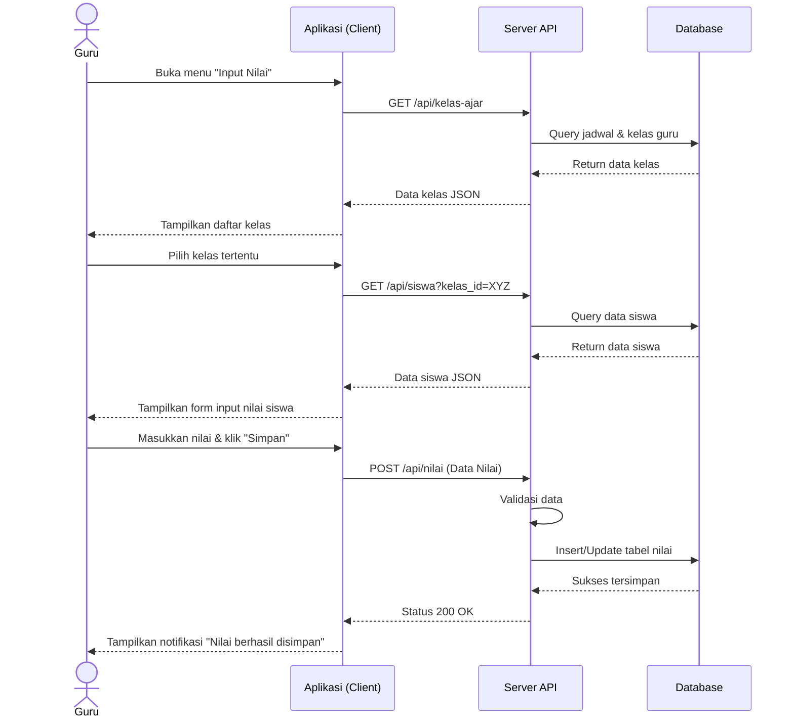

# Diagram Sistem Administrasi Akademik SDN 1 Siliasih

Berikut adalah rancangan awal untuk **Flowchart Utama Sistem** dan **Sequence Diagram** (contoh kasus: Input Nilai oleh Guru) untuk Sistem Administrasi Akademik Digital.

## 1. Flowchart Utama Sistem

Flowchart ini menggambarkan alur kerja umum berdasarkan peran pengguna (Admin, Guru, dan Siswa/Wali Murid).

## 2. Sequence Diagram (Skenario: Input Nilai oleh Guru)

Sequence diagram ini menjelaskan interaksi antar komponen sistem ketika seorang Guru memasukkan nilai untuk siswa.

