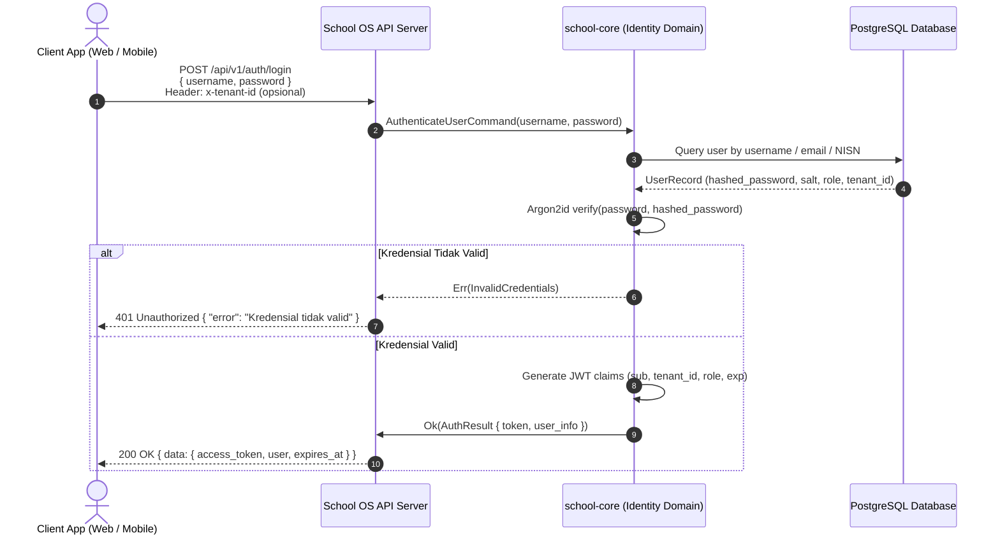
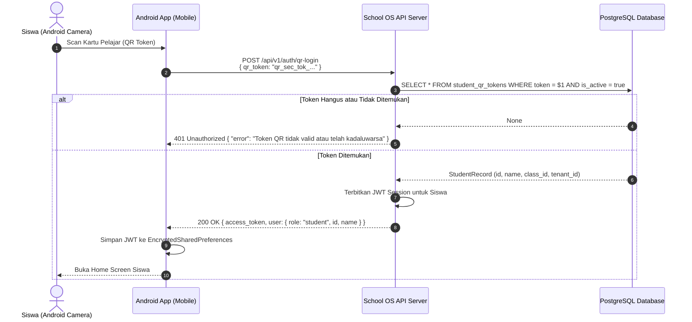

# Alur Autentikasi & Otorisasi School OS (Authentication & Authorization Flow)

Dokumen ini menjelaskan spesifikasi lengkap mekanisme otentikasi, penerbitan token, penanganan sesi pengguna, dan otorisasi multi-tenant di **School OS**.

---

## 1. Ikhtisar Metode Autentikasi

School OS menyediakan dua metode otentikasi utama:
1. **Password-Based JWT Auth (`/api/v1/auth/login`)**: Digunakan oleh Web Portal (Admin Sekolah, Guru, Tata Usaha, Orang Tua, dan Siswa).
2. **Student Card QR-Token Auth (`/api/v1/auth/qr-login`)**: Digunakan oleh Mobile App Android untuk login instan siswa melalui pemindaian kartu fisik pelajar ber-QR Code terenkripsi.

---

## 2. Diagram Alur: Password-Based JWT Authentication



---

## 3. Diagram Alur: QR Token Quick Login (Android Student App)



---

## 4. Struktur Payload JWT Claims

Token JWT ditandatangani menggunakan algoritma `HS256` atau `RS256` dengan payload standar:

```json
{
  "sub": "018e3a2b-9281-7f61-b752-19e49c71a39f",
  "tenant_id": "018e3a2b-1234-7a11-89bc-99a8b7c6d5e4",
  "role": "teacher",
  "name": "Budi Santoso, S.Pd",
  "permissions": [
    "learning:materials:create",
    "learning:assignments:grade",
    "academic:attendance:record"
  ],
  "iat": 1772880000,
  "exp": 1772966400
}
```

---

## 5. Multi-Tenant Context & Header `x-tenant-id`

Setiap request ke backend yang membutuhkan konteks sekolah dapat menyertakan header:
- `Authorization: Bearer <jwt_token>` (Mandatori untuk endpoint terproteksi)
- `x-tenant-id: <tenant_uuid>` (Opsional jika sudah terkandung di dalam klaim token)

Middleware autentikasi (`extractors::RequestContext`) secara otomatis:
1. Memverifikasi integritas dan masa berlaku JWT.
2. Memeriksa kecocokan `tenant_id` antara token dan resource yang diminta guna mencegah kebocoran data antar-sekolah (Multi-Tenant Data Leak Prevention).
