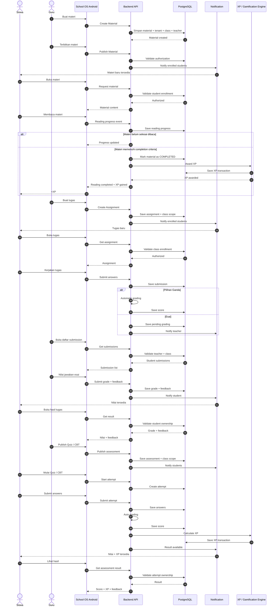

karena flow Android-nya belum 100% terkunci, menurut gue kita jangan langsung bikin sequence diagram per fitur secara terpisah. Kita bikin dulu **master sequence diagram Android School OS** yang menunjukkan bagaimana semua role masuk ke platform, lalu bercabang sesuai hak akses.

Dari struktur yang sudah kita bahas, role Android yang perlu kita masukkan adalah **Siswa, Guru, Kepala Sekolah, dan Admin Sekolah**, dengan modul pembelajaran, absensi QR, chat, notifikasi, dan authorization sebagai backbone.

Saya juga akan mempertahankan keputusan yang sudah dikunci: **AI chat adalah fallback setelah 10 menit**, bukan chatbot terpisah; global library tidak membuat assignment menjadi global; dan akses tetap dibatasi tenant/class/role.

### Master Sequence Diagram — Android School OS

```mermaid
sequenceDiagram
    autonumber

    actor User as Pengguna Android
    participant App as School OS Android
    participant Auth as Auth Service
    participant API as Backend API
    participant DB as PostgreSQL
    participant Notify as Notification Service
    participant AI as AI Helper<br/>(Rule-Based)

    User->>App: Buka aplikasi
    App->>Auth: Login
    Auth->>API: Validasi credentials
    API->>DB: Verifikasi user + role + tenant
    DB-->>API: User + Role + Tenant
    API-->>Auth: Access Token + RBAC Context
    Auth-->>App: Login berhasil
    App->>API: GET /me + permissions
    API-->>App: Profile + Role + Permissions

    alt ROLE = SISWA
        App->>API: Load dashboard siswa
        API->>DB: Ambil kelas + jadwal + tugas + materi + kuis
        DB-->>API: Data siswa
        API-->>App: Dashboard siswa

        opt Absensi QR
            User->>App: Scan QR
            App->>API: Submit attendance
            API->>DB: Validasi QR + siswa + kelas + jadwal + waktu
            DB-->>API: Valid
            API->>DB: Simpan kehadiran
            API-->>App: Absensi berhasil
        end

        opt Learning
            User->>App: Buka Materi / Tugas / Kuis / CBT
            App->>API: Request resource
            API->>DB: Authorization tenant + class + enrollment
            DB-->>API: Resource
            API-->>App: Resource
        end

        opt Chat dengan Guru
            User->>App: Kirim pertanyaan
            App->>API: Create message
            API->>DB: Simpan message
            API->>Notify: Notify teacher

            alt Guru membalas sebelum 10 menit
                Notify-->>App: Teacher response
                App->>API: Sync conversation
                API-->>App: Jawaban Guru
            else Tidak ada respons 10 menit
                API->>AI: Trigger AI Helper
                AI->>DB: Cari knowledge/rule yang sesuai
                AI-->>API: Answer / Escalation
                API->>DB: Simpan AI response
                API->>Notify: Push notification
                Notify-->>App: AI response tersedia
                App->>API: Deep link conversation
                API-->>App: Conversation + AI response
            end
        end

    else ROLE = GURU
        App->>API: Load dashboard guru
        API->>DB: Ambil kelas yang diizinkan
        DB-->>API: Kelas + siswa
        API-->>App: Dashboard guru

        opt Kelola Materi
            User->>App: Pilih kelas + mapel
            App->>API: Request recommended books
            API->>DB: Canonical subject matching
            DB-->>API: recommendedBooks[]
            API-->>App: Primary + companion books

            alt Guru menggunakan Library
                User->>App: Pilih buku
                App->>API: Create material dari book
                API->>DB: Simpan assignment dengan tenant + class
            else Guru mengisi manual
                User->>App: Isi materi manual
                App->>API: Create manual material
                API->>DB: Simpan material
            end

            User->>App: Terbitkan Materi
            App->>API: Publish
            API->>DB: Authorization + save
            API->>Notify: Notify students
        end

        opt Tugas
            User->>App: Buat tugas
            App->>API: Create assignment
            API->>DB: Simpan tugas
            API->>Notify: Notify enrolled students
        end

        opt Kuis / CBT
            User->>App: Buat soal
            App->>API: Save questions
            API->>DB: Simpan + class scope
            User->>App: Publish
            App->>API: Publish assessment
            API->>Notify: Notify students
        end

        opt Chat
            User->>App: Buka pertanyaan siswa
            App->>API: Get conversation
            API->>DB: Authorization teacher + class
            DB-->>API: Conversation
            API-->>App: Conversation
            User->>App: Balas siswa
            App->>API: Send teacher response
            API->>DB: Save response
            API->>Notify: Notify student
        end

    else ROLE = KEPALA SEKOLAH
        App->>API: Load executive dashboard
        API->>DB: Query school-wide data
        DB-->>API: Aggregated school data
        API-->>App: Dashboard keseluruhan

        opt Analytics
            User->>App: Buka statistik
            App->>API: Request analytics
            API->>DB: Aggregate attendance + learning data
            DB-->>API: Analytics
            API-->>App: Charts + statistics
        end

    else ROLE = ADMIN SEKOLAH
        App->>API: Load admin dashboard
        API->>DB: Query tenant administration data
        DB-->>API: Tenant data
        API-->>App: Admin dashboard

        opt Management
            User->>App: Kelola data sekolah
            App->>API: CRUD request
            API->>DB: RBAC + tenant validation
            DB-->>API: Result
            API-->>App: Updated data
        end
    end

    App->>API: Refresh token / sync state
    API-->>App: Updated session state
```



### Tapi ada satu hal penting

Diagram di atas adalah **master flow**, bukan berarti semua role harus mendapatkan UI dan modul yang sama.

Authorization harus terjadi di backend:

```text
                    SCHOOL OS API
                         │
                    Authentication
                         │
                       RBAC
                         │
             ┌───────────┼───────────┐
             │           │           │
           SISWA       GURU      KEPSEK/ADMIN
             │           │           │
          Class ID    Teacher ID   Tenant ID
             │           │           │
             └───────────┼───────────┘
                         │
                  Authorization
                         │
                         ▼
                      DATA
```

Jadi Android **bukan sumber utama keamanan**. Android boleh menyembunyikan menu berdasarkan role untuk UX, tetapi backend tetap harus memvalidasi setiap request.

### Flow siswa yang menurut gue perlu kita kunci

```text
Login
  ↓
Dashboard
  ├── Absensi QR
  ├── Jadwal
  ├── Materi
  ├── Tugas
  ├── Kuis / CBT
  ├── Chat Guru
  ├── Notifikasi
  └── Profil
```

Sedangkan guru:

```text
Login
  ↓
Dashboard Guru
  ├── Kelas Saya
  ├── Materi
  │    ├── Library Recommendation
  │    └── Manual Material
  ├── Tugas
  ├── Kuis / CBT
  ├── Chat Siswa
  ├── Absensi
  └── Notifikasi
```

Kepala sekolah:

```text
Login
  ↓
Dashboard Sekolah
  ├── Statistik Kehadiran
  ├── Statistik Pembelajaran
  ├── Statistik Siswa
  ├── Statistik Kelas
  └── Monitoring
```

Admin:

```text
Login
  ↓
Admin Dashboard
  ├── Data Master
  ├── User & Role
  ├── Siswa
  ├── Guru
  ├── Kelas
  ├── Jadwal
  ├── Absensi
  ├── Konfigurasi
  └── Monitoring
```

Dan **Ibu/akun orang tua** yang sebelumnya sudah kita desain sebaiknya kita perlakukan sebagai role Android tersendiri kalau memang sudah masuk implementasi School OS. Fungsi utamanya berbeda dari siswa: menerima informasi krusial seperti tugas yang belum dikerjakan dan hasil kuis, bukan menerima seluruh notifikasi aktivitas siswa.

nah ini kan belum ada bagaimana cara guru memberi nilai atau siswa melihat nilainya, dan xp bertambah saat materi dari guru ini benar benar di baca siswa, bro, gimana menurut lu, apa perlu di revisi lagi diagram squence nya?

Iya bro. **Perlu direvisi.** Bahkan menurut gue ini justru revisi penting sebelum flow Android kita dikunci.

Diagram sebelumnya baru menggambarkan **content delivery**, belum menggambarkan **learning lifecycle**. Padahal School OS bukan cuma:

> guru upload → siswa membaca

tetapi harus menjadi:

> guru membuat → siswa menerima → siswa belajar → sistem memverifikasi aktivitas → XP/progress bertambah → guru menilai → siswa melihat hasil.

Jadi kita perlu memasukkan minimal 4 lifecycle baru:

1. **Guru memberikan tugas/assessment dan nilai**
2. **Siswa mengerjakan dan melihat nilai**
3. **Materi benar-benar dibaca → reading progress → XP**
4. **Progress/XP menjadi bagian dari dashboard siswa**

Dan ada satu prinsip penting: **XP jangan bertambah hanya karena siswa membuka materi.** Harus ada bukti minimal bahwa materi memang dibaca, misalnya progress halaman/scroll + dwell time + completion event. Kalau cuma `open_material = true`, siswa bisa buka lalu keluar dan tetap mendapatkan XP.

Saya akan revisi master sequence-nya menjadi seperti ini:



Nah, **ini baru mulai kelihatan School OS sebagai LMS**, bukan sekadar aplikasi administrasi sekolah.

Ada satu hal lagi yang menurut gue harus kita kunci sebelum implementasi: **bedakan tiga jenis angka**.

```text
NILAI
↓
Hasil akademik
Contoh: 85/100
```

```text
XP
↓
Progress/gamification
Contoh: +20 XP
```

```text
READING PROGRESS
↓
Aktivitas belajar
Contoh: 18/20 halaman
```

Jangan sampai ketiganya tercampur.

Contohnya:

```text
Siswa membaca Materi Fisika
        ↓
18/20 halaman
        ↓
Completion criteria terpenuhi
        ↓
+10 XP
```

Lalu:

```text
Siswa mengerjakan Tugas Fisika
        ↓
Guru memberikan nilai 85
        ↓
Nilai akademik = 85
```

Dan:

```text
Siswa menyelesaikan CBT
        ↓
Score = 90
        ↓
+30 XP
```

Jadi dashboard siswa nantinya bisa punya:

```text
┌──────────────────────────────┐
│ BUDI                         │
│                              │
│ ⭐ 1.250 XP                  │
│ Level 8                      │
│                              │
│ Progress Belajar             │
│ ████████████░░ 82%           │
│                              │
│ Nilai                        │
│ Matematika       88          │
│ Fisika           85          │
│ Bahasa Indonesia 91          │
│                              │
│ Tugas                         │
│ 8 selesai / 2 belum          │
└──────────────────────────────┘
```

Dan untuk **reading XP**, gue sangat menyarankan backend yang menentukan completion. Android hanya mengirim event/progress.

Misalnya:

```text
Android
   │
   │ page 1
   │ page 2
   │ page 3
   │ ...
   ▼
Backend
   │
   ├── progress = 85%
   │
   ├── minimum reading criteria?
   │
   └── sudah pernah dapat XP?
          │
          ├── NO  → Award XP
          └── YES → Jangan award lagi
```

Ini penting supaya siswa tidak bisa melakukan:

```text
Buka materi
→ +10 XP

Keluar
→ buka lagi
→ +10 XP

Keluar
→ buka lagi
→ +10 XP
```

Jadi database XP sebaiknya punya **transaction/idempotency reference** terhadap aktivitas yang menghasilkan XP.

Contohnya secara konsep:

```text
XP_TRANSACTION

student_id
source_type
source_id
xp_amount
created_at
```

dengan constraint agar event yang sama tidak bisa memberikan XP dua kali.

Dan ada satu konsekuensi besar dari revisi ini:

**Role Matrix Android kita juga harus direvisi.**

Karena sekarang modulnya sudah menjadi:

```text
SISWA
├── Materi
├── Reading Progress
├── XP / Level
├── Tugas
├── Submission
├── Nilai
├── Kuis
├── CBT
├── Chat Guru
├── Absensi
└── Notifikasi

GURU
├── Materi
├── Library
├── Tugas
├── Koreksi
├── Nilai
├── Kuis
├── CBT
├── Chat
├── Absensi
└── Monitoring

KEPALA SEKOLAH
├── Dashboard
├── Analytics
├── Kehadiran
├── Pembelajaran
└── Monitoring

ADMIN
├── Data Master
├── User
├── Kelas
├── Jadwal
├── Konfigurasi
└── Management
```

Jadi jawaban gue: **iya, diagram sebelumnya memang harus direvisi.** Justru bagus lu menangkap ini sekarang sebelum kita mengunci navigation Android.

Dan setelah tambahan **nilai + submission + reading progress + XP**, saya akan menjadikan **Learning Lifecycle** sebagai backbone sequence diagram Android School OS. Chat AI, Library, Notification, dan Absensi kemudian menjadi subsystem yang mengelilinginya.
