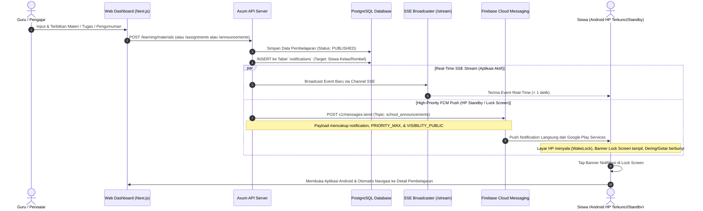
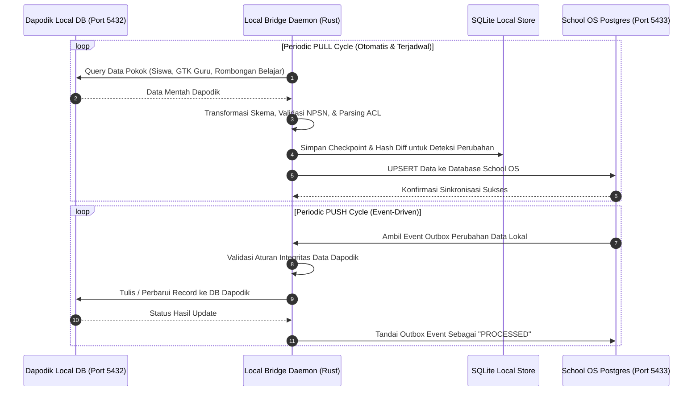

# Spesifikasi Arsitektur Sistem School OS

Dokumen ini menyajikan arsitektur sistem secara menyeluruh, terperinci, dan komprehensif untuk **School OS**. Dokumen ini mencakup prinsip arsitektur (ADR), struktur folder mendalam, *tech stack*, diagram alur kerja (*sequence & dataflow*), serta rincian fungsionalitas di setiap modul berdasarkan kondisi aktual basis kode proyek.

---

## 1. Prinsip & Keputusan Arsitektur (Architectural Decision Records / ADR)

Sistem School OS dibangun di atas prinsip-prinsip arsitektur modern untuk menjamin kemudahan pemeliharaan, keamanan, performa tinggi, serta isolasi data:

1. **Clean Architecture (ADR-0001):** Pemisahan lapisan yang ketat antara *Presentation* (HTTP/Axum), *Domain/Business Logic* (`school-core`), dan *Infrastructure* (Database/SQLx, FCM, Smart Reminder, & Observability).
2. **Domain-Driven Design / DDD (ADR-0002):** Pengelompokan logika berdasarkan konteks terisolasi (*Bounded Contexts*) seperti `identity`, `academic`, `learning`, `people`, `communication`, dan `reporting`.
3. **Event-Driven Architecture (ADR-0003):** Penggunaan pola *Outbox Event* (`outbox_events`) untuk menangani sinkronisasi eksternal/internal secara asinkron tanpa memblokir transaksi database utama.
4. **Multi-Tenant Schema & Isolation (ADR-0004):** Sistem mendukung multi-sekolah/tenant dengan identifikasi tenant terisolasi (termasuk penanganan NPSN unik sekolah).
5. **UUID v7 (ADR-0005):** Penggunaan Primary Key bertipe UUID v7 yang *time-sortable* untuk mengoptimalkan performa indeks B-Tree pada PostgreSQL dan SQLite.
6. **Frontend Feature-Sliced Design / FSD (ADR-0006):** Pengorganisasian kode *frontend* berdasarkan fitur (`features/`) dan lapisan teratur (`app`, `widgets`, `components`, `shared`, `lib`).
7. **Assessment Domain Decoupling (ADR-0007):** Pemisahan mesin penilaian (*assessment & quiz*) dari logika akademik umum agar dapat dikembangkan dan diuji secara independen.

---

## 2. Struktur Folder & Modul Lengkap

Sistem ini disusun dalam struktur **Monorepo** yang menampung *Backend (Rust)*, *Frontend (Next.js)*, *Mobile (Android/Kotlin)*, *Dokumentasi (ADR & Docs)*, dan *Infrastruktur (Docker)*.

```
School OS/
├── .github/                     # Workflow CI/CD GitHub Actions
├── ADR/                         # Architectural Decision Records (ADR 0001 - 0007)
├── android/                     # Aplikasi Mobile Android (Kotlin Clean Architecture + Compose)
│   ├── app/                     # Modul utama aplikasi Android (Application, MainActivity, NavGraph)
│   ├── core/                    # Library internal, Design System, SystemNotificationHelper, AuthManager
│   ├── data/                    # Data sources, Remote API clients, Repository implementations, DTOs
│   ├── domain/                  # Use cases, Domain models, Repository interfaces
│   ├── feature/                 # 11 Modul Fitur UI Berbasis Jetpack Compose:
│   │   ├── achievements/        # Gamifikasi & Lencana Prestasi Siswa
│   │   ├── assignments/         # Pengerjaan Tugas (Pilihan Ganda/Esai), Upload Berkas, & Pemeriksaan Guru
│   │   ├── auth/                # Login, Validasi Sesi, & Pemindai Login QR Code (CameraX)
│   │   ├── grades/              # Buku Nilai & Transkrip Nilai Akademik
│   │   ├── home/                # Dashboard Dinamis (Siswa, Guru, Orang Tua, & Wali Kelas)
│   │   ├── learning/            # Akses Materi, Video Pembelajaran, & Buku Kurikulum Nasional SIBI
│   │   ├── notifications/       # Broadcast Center, SSE Stream, FCM Push Receiver, & Chat Tanya Guru
│   │   ├── profile/             # Profil, Ganti Tema (Dark/Light), Bantuan Sekolah, & Pengaturan Keamanan
│   │   ├── progress/            # Grafik & Visualisasi Kemajuan Belajar Siswa
│   │   ├── quizzes/             # CBT Interactive Player, Timer Ujian, Anti-Cheat, & Nilai Instan
│   │   └── sessions/            # Jadwal Pelajaran Harian & Presensi Sesi Kelas
│   └── build.gradle.kts         # Konfigurasi Gradle Root (Kotlin DSL, MinSDK 26, TargetSDK 35)
├── backend/                     # Rust Workspace Utama
│   ├── Cargo.toml               # Config Rust Workspace (api-server, school-core, local-bridge, hash-gen)
│   ├── api-server/              # Entry point HTTP REST API (Axum Framework)
│   │   ├── Cargo.toml
│   │   └── src/
│   │       ├── bootstrap/       # Inisialisasi State Aplikasi, DB Pools, Context, & Worker Runners
│   │       ├── infrastructure/  # Komponen Infrastruktur:
│   │       │   ├── fcm.rs       # FCM HTTP v1 High-Priority Push Engine (Lockscreen & Standby Wakeup)
│   │       │   ├── smart_reminder_worker.rs # Worker Jadwal Mengajar Guru & Materi Terjadwal (Quiet Hours)
│   │       │   └── observability/ # Prometheus Metrics, Tracing, & Logging
│   │       ├── presentation/    # Endpoints HTTP / Handlers per modul:
│   │       │   ├── academic/    # API Akademik (Kelas, Rombel, Tahun Ajaran, Mata Pelajaran, Jadwal)
│   │       │   ├── analytics/   # API Laporan Analitik & Statistik Akademik
│   │       │   ├── announcements/# API Pengumuman Sekolah, Broadcast Multi-Target, & SSE Stream (/stream)
│   │       │   ├── auth/        # API Autentikasi (JWT Login, Token Refresh, QR Login Token)
│   │       │   ├── dapodik/     # API Integrasi, Pemetaan Status, & Audit Sinkronisasi Dapodik
│   │       │   ├── health/      # Health Check, Liveness, & Readiness Probes
│   │       │   ├── learning/    # Modul Pembelajaran Lengkap:
│   │       │   │   ├── achievement/ # Gamifikasi & Penghargaan Siswa
│   │       │   │   ├── assessment/  # Pengaturan Aturan & Rekapitulasi Nilai Akhir
│   │       │   │   ├── assignments/ # Pembuatan Tugas, Soal PG/Esai, Pengumpulan, & Penilaian Guru
│   │       │   │   ├── curricula/   # Kurikulum Nasional & Sekolah
│   │       │   │   ├── feed/        # Classroom Feeds & Linimasa Kelas
│   │       │   │   ├── inquiries/   # Tanya Guru / Q&A Konsultasi Interaktif Siswa-Guru (Chat Persistence)
│   │       │   │   ├── lessons/     # Rencana Pembelajaran Harian & Jurnal Guru
│   │       │   │   ├── library/     # Perpustakaan Digital Nasional SIBI Kemdikdasmen & Progres Baca
│   │       │   │   ├── materials/   # Modul Belajar, Bahan Ajar, & Tracking Penyelesaian Siswa
│   │       │   │   ├── progress/    # Pelacakan Kemajuan Kompetensi Belajar Siswa
│   │       │   │   ├── quizzes/     # Computer-Based Testing (CBT), Bank Soal, & Timer Kuis
│   │       │   │   ├── sessions/    # Jadwal Sesi Pelajaran & Presensi Kehadiran
│   │       │   │   └── syllabuses/  # Silabus Mata Pelajaran
│   │       │   ├── notifications/# API Notifikasi Pengguna, Preferensi Kanal, & Deduplikasi
│   │       │   ├── people/      # API Data Siswa, Guru, Tenaga Kependidikan, & Wali Murid
│   │       │   ├── school/      # API Profil Sekolah, Logo, & Pengaturan Sinkronisasi Dapodik
│   │       │   ├── system/      # API Pengaturan Sistem Global & Maintenance Mode Gatekeeper
│   │       │   └── tenant/      # API Manajemen Tenant/Sekolah & Verifikasi NPSN
│   │       ├── error.rs         # Penanganan error terpadu & pemetaan HTTP status
│   │       ├── extractors.rs    # Custom Axum Extractors (Auth User Context, Tenant ID)
│   │       ├── idempotency.rs   # Middleware proteksi idempotency request
│   │       ├── middleware.rs    # Middleware CORS, Security Headers, RBAC Permission, & Tracing
│   │       ├── response.rs      # Format standar JSON Response API
│   │       └── main.rs          # Entry point pengelasan server Axum
│   ├── school-core/             # Crate Logika Domain Bisnis Murni (Clean Architecture & DDD)
│   │   ├── Cargo.toml
│   │   └── src/
│   │       ├── academic/        # Domain Kurikulum, Silabus, Rombel, & Tahun Ajaran
│   │       ├── audit/           # Log Audit Transaksi Sensitif
│   │       ├── authorization/   # RBAC & Evaluasi Hak Akses Pengguna
│   │       ├── common/          # Value Objects, Error Types, & Pagination Models
│   │       ├── communication/   # Pengumuman & Feed Kelas
│   │       ├── config/          # Konfigurasi Domain
│   │       ├── identity/        # Domain Akun, Password Hashing (Argon2), & Kredensial
│   │       ├── integration/     # Kontrak & Transformasi Integrasi Eksternal
│   │       ├── learning/        # Mesin Inti Pembelajaran, Tugas, Kuis, & Penilaian
│   │       ├── notification/    # Logika Pengiriman, Preferensi, & Template Notifikasi
│   │       ├── people/          # Domain Siswa, Guru, Staf, & Orang Tua
│   │       ├── permission/      # Registri & Enumerasi Hak Akses Granular
│   │       ├── policy/          # Aturan Bisnis & Kebijakan Batas Waktu Evaluasi
│   │       └── reporting/       # Rekapitulasi Rapor & Analitik Pembelajaran
│   ├── local-bridge/            # Agen Daemon Latar Belakang untuk Sinkronisasi Dapodik
│   │   ├── Cargo.toml
│   │   └── src/
│   │       ├── auth/            # Otentikasi Agen ke Server Lokal & Dapodik
│   │       ├── dapodik_acl/     # Access Control List & Parser DB Dapodik
│   │       ├── domain/          # Model transformasi skema Dapodik <-> School OS
│   │       ├── store/           # Penyimpanan lokal (SQLite & Windows Credential Manager / Keyring)
│   │       ├── sync/            # Engine Sinkronisasi (PULL Data Pokok & PUSH Nilai)
│   │       └── main.rs          # Runner daemon agen lokal
│   ├── hash-gen/                # CLI Utilitas Pengujian Hashing Password (Argon2)
│   └── migrations/              # 58 File Migrasi Database PostgreSQL (SQLx)
│       ├── 0001_create_tenant_schema.sql - 0006_create_access_control_schema.sql
│       ├── 20260708205700_create_idempotency_keys.sql & outbox_events
│       ├── 20260708220000 - 231000 (Materi, Tugas, Kuis, Penilaian, Progress, Notifikasi)
│       ├── 20260811000000_create_dapodik_sync_tables.sql
│       ├── 20260819000000_create_system_settings.sql (Maintenance Mode)
│       ├── 20260830000000_create_user_qr_tokens.sql (QR Login Engine)
│       ├── 20260904000000_create_class_schedules.sql & announcements.sql
│       ├── 20260910183000_create_inquiries_schema.sql (Tanya Guru)
│       ├── 20260917030000_create_assignment_questions.sql (Soal PG & Esai Tugas)
│       ├── 20260917040000_create_notification_dedup_and_queue.sql (Queue & Dedup)
│       └── 20260917050000 - 080000 (Perpustakaan Digital Buku SIBI Kemdikdasmen)
├── frontend/                    # Aplikasi Web Next.js (App Router + Feature-Sliced Design)
│   ├── package.json
│   ├── tsconfig.json
│   ├── openapi-ts.config.ts     # Konfigurasi Auto-generate SDK Client dari OpenAPI Rust
│   └── src/
│       ├── app/                 # Next.js App Router (Pages & Layouts)
│       │   ├── (auth)/          # Halaman Login Multi-Role, QR Login, & Lupa Password
│       │   ├── (dashboard)/     # 19 Menu Dashboard Operasional Sekolah:
│       │   │   └── dashboard/   # Classes, Students, Teachers, Learning, Quizzes, Grading, Dapodik, dll.
│       │   ├── parent/          # Portal Khusus Orang Tua / Wali Murid (Nilai, Presensi, Pengumuman)
│       │   ├── system-admin/    # Portal Super Admin (Multi-Tenant Management & Maintenance Mode)
│       │   ├── api/             # Next.js API Routes Proxy (opsional)
│       │   ├── layout.tsx       # Root Layout & Theme Provider
│       │   └── globals.css      # Design System Pure CSS Variables & Utility Classes
│       ├── authorization/       # Logic Otentikasi & Guard Komponen Frontend
│       ├── components/          # Reusable UI Components (DataTable, Modal, Form Controls)
│       ├── contexts/            # React Contexts (User Session, UI State)
│       ├── features/            # Modul Fitur Frontend:
│       │   ├── assessment/      # Komponen Penilaian & Rekapitulasi Nilai
│       │   ├── assignment/      # Komponen Manajemen Tugas & Grading Guru
│       │   ├── lesson/          # Komponen Sesi Pembelajaran & Jurnal Guru
│       │   ├── material/        # Manajemen Modul, Bahan Ajar, & Video
│       │   └── quiz/            # Interaktif Player Kuis Siswa
│       ├── lib/                 # Utilitas SDK & Integrasi API (`api.ts`, `dapodik-bridge.ts`)
│       ├── providers/           # Providers Wrapper (`QueryClientProvider`, ThemeProvider)
│       └── shared/              # Utilitas & Tipe Data Terbagi (Helpers, Validasi)
├── docker-compose.yml           # Mengisolasi PostgreSQL di Port 5433 (Mencegah Bentrok Port Dapodik 5432)
├── start-schoolos.ps1           # Script Otomasi Running Environment (PowerShell)
└── docs/                        # Dokumentasi Sistem (Arsitektur & Panduan Penggunaan)
```

---

## 3. Tech Stack Lengkap

| Lapisan / Komponen | Teknologi | Keterangan & Penggunaan |
| :--- | :--- | :--- |
| **Web Frontend** | **Next.js 16 (React 19)** | Framework React modern dengan App Router, Server Components, & SSR |
| | **TypeScript 5.9** | Type safety mutlak di seluruh basis kode *frontend* |
| | **React Query (@tanstack)** | Caching, async state management, dan automatic background re-fetching |
| | **React Hook Form & Zod** | Manajemen formulir interaktif & validasi skema runtime |
| | **@hey-api/openapi-ts** | Autogenerasi Klien API TypeScript dari OpenAPI endpoint Rust server |
| | **Pure CSS & CSS Modules** | Design System fleksibel berbasis CSS Native Variables tanpa overhead utility library |
| | **Vitest & Testing Library** | Unit testing & Component testing di frontend |
| **Backend Core** | **Rust (Edition 2024)** | Bahasa pemrograman utama backend (Performa tinggi, memory safety, tanpa GC) |
| | **Axum 0.8** | Web framework asinkron performa tinggi berbasis Tower & Hyper |
| | **Tokio 1.52** | Asynchronous runtime multi-threaded untuk penanganan I/O tinggi |
| | **SQLx 0.7** | Pure Rust Async SQL crate dengan compile-time query validation |
| | **Utoipa 5.5** | Auto-generator dokumentasi OpenAPI / Swagger UI interaktif di Rust |
| | **Argon2 & JWT** | Autentikasi aman berbasis standar industri dengan enkripsi password kuat |
| **Notifikasi & Real-Time** | **Firebase Cloud Messaging (HTTP v1)** | Push notification prioritas tinggi dengan integrasi Lock Screen banner & WakeLock |
| | **Server-Sent Events (SSE)** | Kanal streaming real-time berlatensi rendah (< 1s) untuk pengumuman & broadcast |
| | **Smart Reminder Worker** | Worker penjadwalan cerdas pengingat jam mengajar & materi otomatis (Quiet Hours) |
| **Local Bridge Agent** | **Rust & Tokio** | Daemon latar belakang independen untuk komunikasi Dapodik |
| | **SQLite & PostgreSQL** | Cache data lokal & koneksi langsung ke Dapodik DB lokal |
| | **Reqwest & Keyring** | Komunikasi HTTPS aman & penyimpanan rahasia OS (Windows Credential Manager / Keychain) |
| **Mobile App** | **Kotlin & Android SDK (API 26-35)** | Aplikasi Native Android dengan Clean Architecture |
| | **Jetpack Compose** | Modern Declarative UI Framework di Android |
| | **Hilt & Coroutines** | Dependency Injection & asynchronous execution management |
| | **CameraX** | Pemindaian QR Code untuk otentikasi login instan |
| **Database & Infrastructure** | **PostgreSQL 15 Alpine** | Database Relasional Utama dengan 58 file migrasi terstruktur |
| | **Docker & Docker Compose** | Containerization environment lokal & production staging |
| | **Isolated Port (5433)** | Mengisolasi DB School OS dari port default 5432 milik Dapodik sekolah |

---

## 4. Diagram Alur Kerja (Workflow Diagrams)

### A. High-Level System Architecture Diagram

```mermaid
graph TD
    subgraph Clients [Client Layer]
        WebClient[Web Browser / Next.js Admin & Teacher]
        ParentPortal[Parent Portal / Next.js Responsive]
        MobileClient[Android Native App / Compose]
    end

    subgraph FrontendServer [Frontend Presentation Layer]
        NextApp[Next.js App Router\nPort: 3000]
    end

    subgraph BackendCluster [Backend Layer - Rust Workspace]
        ApiServer[Axum REST API Server\nPort: 8000 / 8080]
        
        subgraph CoreModules [School Core DDD Engine]
            IdentityDomain[Identity, RBAC, & QR Token]
            PeopleDomain[People, Student, Teacher, & Guardian]
            LearningDomain[Learning, Assignments, CBT Quizzes, & SIBI Library]
            CommunicationDomain[Announcements, SSE Stream, & Inquiries Chat]
            NotificationDomain[Notification Queue, Dedup, & FCM Engine]
            AuditDomain[Audit Trails & Outbox Events]
        end

        subgraph BackgroundWorkers [Internal Background Workers]
            ReminderWorker[Smart Reminder Worker\nJadwal Mengajar & Quiet Hours]
            SSEBroadcast[SSE Real-time Broadcaster]
        end
        
        LocalBridgeDaemon[Local Bridge Agent Daemon\nDapodik Background Sync Process]
    end

    subgraph CloudServices [Push Services]
        GoogleFCM[Google Firebase Cloud Messaging\nHTTP v1 API]
    end

    subgraph DatabaseLayer [Persistence Layer]
        PostgresDB[(PostgreSQL School OS DB\nHost Port: 5433 / Container: 5432)]
        LocalSQLite[(Local SQLite Cache DB)]
    end

    subgraph ExternalSystem [External School Environment]
        DapodikDB[(Dapodik Local PostgreSQL DB\nHost Port: 5432)]
    end

    %% Client Interactions
    WebClient <-->|HTTPS / JSON| NextApp
    ParentPortal <-->|HTTPS / JSON| NextApp
    NextApp <-->|REST API / OpenAPI| ApiServer
    MobileClient <-->|REST API / OpenAPI| ApiServer
    MobileClient <-->|SSE Stream / Real-time| ApiServer

    %% Push & SSE
    ApiServer -->|Trigger FCM| GoogleFCM
    GoogleFCM -->|Push Banner to Lock Screen| MobileClient
    ApiServer --> ReminderWorker
    ReminderWorker --> PostgresDB

    %% Internal Modules
    ApiServer --> IdentityDomain
    ApiServer --> PeopleDomain
    ApiServer --> LearningDomain
    ApiServer --> CommunicationDomain
    ApiServer --> NotificationDomain
    ApiServer --> AuditDomain

    IdentityDomain <-->|SQLx Async| PostgresDB
    PeopleDomain <-->|SQLx Async| PostgresDB
    LearningDomain <-->|SQLx Async| PostgresDB
    CommunicationDomain <-->|SQLx Async| PostgresDB
    NotificationDomain <-->|SQLx Async| PostgresDB
    AuditDomain <-->|SQLx Async| PostgresDB

    LocalBridgeDaemon <-->|PULL / PUSH Sync Loop| PostgresDB
    LocalBridgeDaemon <-->|Local Cache| LocalSQLite
    LocalBridgeDaemon <-->|Read / Write Sync| DapodikDB
```



---

### B. Siklus Penerbitan Pembelajaran & Notifikasi (*Teacher Publish Flow*)

Alur kerja ketika Guru menerbitkan materi, tugas baru, atau pengumuman sekolah:



---

### C. Dapodik Sync Engine Workflow (Local Bridge)



---

## 5. Rincian Fungsionalitas Modul Utama

### 5.1. Identity, Access Management, & QR Auth (IAM)
- **Multi-Tenant Isolation:** Dukungan multi-sekolah dengan data *tenant* terisolasi penuh dan validasi Nomor Pokok Sekolah Nasional (NPSN).
- **Role-Based Access Control (RBAC):** Hak akses granular untuk Administrator, Kepala Sekolah, Operator Dapodik, Guru, Siswa, dan Orang Tua.
- **QR Code Authentication:** Dukungan login instan menggunakan pemindaian kode QR via kamera Android (`CameraX`) tanpa perlu mengetik kredensial secara manual di lingkungan lab komputer atau perangkat bersama.
- **Session Security & Maintenance Mode:** Proteksi JWT dengan refresh token, middleware inspeksi *Maintenance Mode* global yang dapat diaktifkan sewaktu-waktu oleh Super Admin.

### 5.2. Manajemen Akademik & Data Pokok (People & Academic)
- **Struktur Sekolah:** Pengelolaan Tahun Ajaran aktif, Tingkat Kelas, Rombongan Belajar (Rombel), dan Mata Pelajaran Kurikulum Nasional.
- **Data Entitas:** Profil Guru & Tenaga Kependidikan (GTK), penugasan Guru Pengampu Mata Pelajaran & Wali Kelas, biodata Siswa, serta akun Wali Murid.
- **Jadwal Pelajaran Mingguan (`class_schedules`):** Manajemen slot waktu jam belajar mengajar per hari untuk masing-masing kelas.

### 5.3. Mesin Pembelajaran & Evaluasi Terpadu (Learning Engine)
- **Materi & Bahan Ajar (Materials):** Unggah modul pembelajaran, video YouTube/tautan eksternal, dokumen panduan, dan pelacakan status selesai baca siswa (`student_material_completions`).
- **Jurnal & Rencana Pembelajaran (Lessons & Sessions):** Pencatatan agenda mengajar guru per pertemuan kelas dan presensi kehadiran siswa.
- **Tugas Terstruktur (Assignments):** Pembuatan tugas berstruktur soal (Pilihan Ganda & Esai dengan rubrik penilaian), batas waktu pengumpulan, riwayat *submission attempts*, dan penilaian guru.
- **Ujian Berbasis Komputer (CBT / Quizzes):** Mesin kuis interaktif dengan acak soal, timer pengerjaan otomatis (*countdown*), proteksi pindah tab/aplikasi, dan kalkulasi skor otomatis.
- **Perpustakaan Digital Terintegrasi SIBI Kemdikdasmen:** Katalog buku kurikulum nasional Kurikulum Merdeka terverifikasi resmi Kemdikdasmen untuk Siswa dan Guru (SD, SMP, SMA/SMK) dengan pembaca PDF terintegrasi dan pelacakan progres membaca.
- **Tanya Guru & Konsultasi (Inquiries):** Forum konsultasi privat/interaktif antara siswa dan guru mata pelajaran untuk memperdalam materi di luar jam tatap muka.
- **Gamifikasi & Prestasi (Achievements):** Sistem lencana pencapaian belajar untuk meningkatkan motivasi belajar siswa.

### 5.4. Sistem Notifikasi Multi-Saluran & Smart Reminder (Omnichannel Alerts)
- **FCM High-Priority Push Notification:** Notifikasi berprioritas tinggi (`PRIORITY_MAX`) dengan channel `school_os_announcements_v3` dan visibilitas publik di *Lock Screen*. Mengaktifkan layar HP sesaat (*WakeLock*) sehingga pesan resmi sekolah dipastikan terbaca walaupun HP dalam keadaan tidur (*standby*).
- **Server-Sent Events (SSE Stream):** Jalur transmisi pengumuman instan dengan latensi di bawah 1 detik ketika aplikasi sedang dibuka di web browser atau smartphone.
- **Smart In-App Deduplication:** Algoritma pencegahan banner duplikat antara jalur SSE, Polling, dan Push FCM dengan *time window* 60 detik.
- **Smart Reminder Worker:** Agen latar belakang yang mengevaluasi jadwal kelas 15 menit sebelum sesi mengajar dimulai dan mematuhi batas *Quiet Hours* (21:00 - 06:00 WIB).

### 5.5. Engine Integrasi Dapodik (Local Bridge Daemon)
- Bekerja sebagai daemon latar belakang independen di server atau PC sekolah.
- Menghubungkan database Dapodik lokal (port default 5432) dengan database School OS (port 5433) tanpa risiko bentrok port.
- Menyediakan mekanisme verifikasi hash diff dan *conflict resolution* untuk menjamin konsistensi data Dapodik dan School OS.

### 5.6. Portal Khusus Pengguna
- **Dashboard Manajemen Sekolah (Web):** 19 modul operasional untuk Admin, Operator, dan Guru dalam mengelola KBM, ujian CBT, absensi, dan penilaian.
- **Portal Orang Tua (Parent Portal):** Antarmuka web ramah pengguna bagi wali murid untuk memantau nilai anak, rekap kehadiran, dan pengumuman sekolah secara transparan.
- **Aplikasi Mobile Android Native:** Aplikasi mobile berbasis Jetpack Compose dengan arsitektur bersih, performa gesit, dan konsumsi memori hemat.

### 5.7. Audit Trail, Idempotency, & Keandalan Sistem
- **Audit Logs:** Pencatatan otomatis setiap tindakan mutasi data untuk audit kepatuhan dan keamanan.
- **Idempotency Protection:** Penanganan *Idempotency Keys* pada transaksi pengumpulan tugas dan penilaian untuk mencegah duplikasi data akibat ketidakstabilan jaringan internet.

---
*Dokumen arsitektur ini diperbarui secara berkala dan merefleksikan seluruh kode program, skema database, serta struktur modul aktif di dalam repositori School OS.*