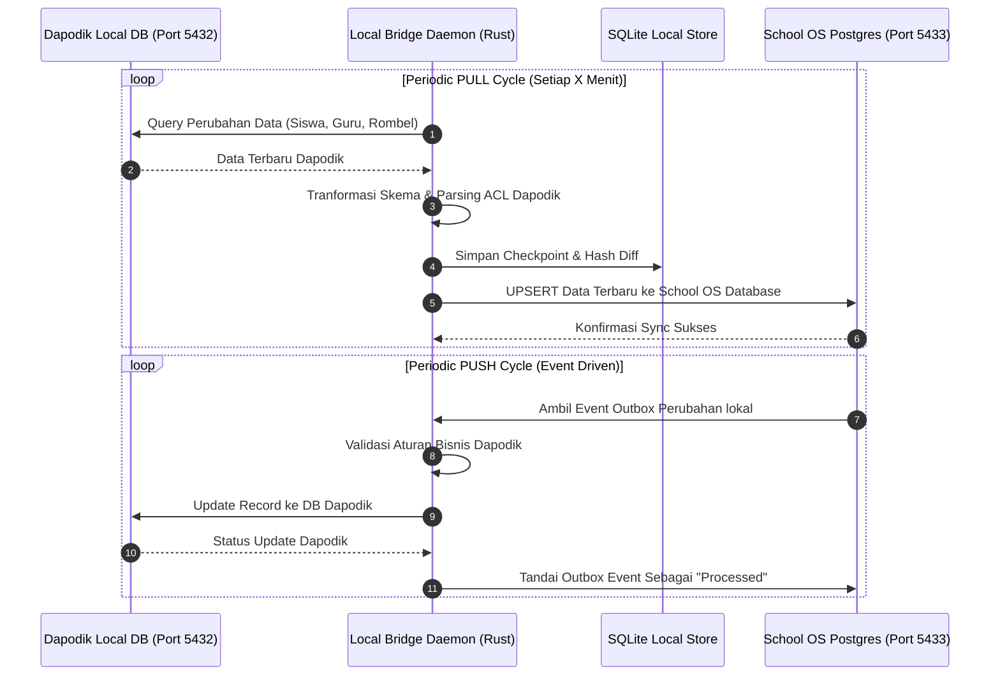

# Spesifikasi Arsitektur Sistem School OS

Dokumen ini menyajikan arsitektur sistem secara menyeluruh, terperinci, dan komprehensif untuk **School OS**. Dokumen ini mencakup prinsip arsitektur (ADR), struktur folder mendalam, *tech stack*, diagram alur kerja (*sequence & dataflow*), serta rincian fungsionalitas di setiap modul.

---

## 1. Prinsip & Keputusan Arsitektur (Architectural Decision Records / ADR)

Sistem School OS dibangun di atas prinsip-prinsip arsitektur modern untuk menjamin kemudahan pemeliharaan, keamanan, performa tinggi, serta isolasi data:

1. **Clean Architecture (ADR-0001):** Pemisahan lapisan yang ketat antara *Presentation* (HTTP/Axum), *Domain/Business Logic* (`school-core`), dan *Infrastructure* (Database/SQLx & Observability).
2. **Domain-Driven Design / DDD (ADR-0002):** Pengelompokan logika berdasarkan konteks terisolasi (*Bounded Contexts*) seperti `identity`, `academic`, `learning`, `people`, dan `reporting`.
3. **Event-Driven Architecture (ADR-0003):** Penggunaan pola *Outbox Event* (`outbox_events`) untuk menangani event eksternal/internal secara asinkron tanpa memblokir transaksi database utama.
4. **Multi-Tenant Schema & Isolation (ADR-0004):** Sistem mendukung multi-sekolah/tenant dengan identifikasi tenant terisolasi (termasuk penanganan NPSN sekolah).
5. **UUID v7 (ADR-0005):** Penggunaan Primary Key bertipe UUID v7 yang *time-sortable* untuk mengoptimalkan performa indeks B-Tree pada PostgreSQL dan SQLite.
6. **Frontend Feature-Sliced Design / FSD (ADR-0006):** Pengorganisasian kode *frontend* berdasarkan fitur (`features/`) dan lapisan teratur (`app`, `widgets`, `components`, `shared`, `lib`).
7. **Assessment Domain Decoupling (ADR-0007):** Pemisahan mesin penilaian (*assessment & quiz*) dari logika akademik umum agar dapat dikembangkan dan diuji secara independen.

---

## 2. Struktur Folder & Modul Lengkap

Sistem ini disusun dalam struktur **Monorepo** yang menampung *Backend (Rust)*, *Frontend (Next.js)*, *Mobile (Android/Kotlin)*, *Dokumentasi (ADR)*, dan *Infrastruktur (Docker)*.

```
School OS/
├── .github/                     # Workflow CI/CD GitHub Actions
├── ADR/                         # Architectural Decision Records (ADR 0001 - 0007)
├── android/                     # Aplikasi Mobile Android (Kotlin Clean Architecture)
│   ├── app/                     # Modul utama aplikasi Android
│   ├── core/                    # Library internal & utilitas umum Android
│   ├── data/                    # Data sources, repository implementations, DTOs
│   ├── domain/                  # Use cases, domain models, repository interfaces
│   ├── feature/                 # Fitur-fitur UI (Jetpack Compose / Screens)
│   └── build.gradle.kts         # Gradle configuration (Kotlin DSL)
├── backend/                     # Rust Workspace utama
│   ├── Cargo.toml               # Config Rust Workspace (members: api-server, school-core, local-bridge, hash-gen)
│   ├── api-server/              # Entry point HTTP REST API (Axum Framework)
│   │   ├── Cargo.toml
│   │   └── src/
│   │       ├── bootstrap/       # Inisialisasi State Aplikasi, DB Pools, & Context
│   │       ├── infrastructure/  # Observability (Prometheus Metrics, Tracing, Logging)
│   │       ├── presentation/    # Endpoints HTTP / Handlers per modul:
│   │       │   ├── academic/    # API Akademik (Kelas, T.A., Mata Pelajaran)
│   │       │   ├── analytics/   # API Laporan & Analitik
│   │       │   ├── auth/        # API Autentikasi (Login, Register, Token Refresh)
│   │       │   ├── dapodik/     # API Integrasi & Status Sinkronisasi Dapodik
│   │       │   ├── health/      # Health Check & Readiness Probes
│   │       │   ├── learning/    # API Modul Pembelajaran, Tugas, & Kuis
│   │       │   ├── notifications/# API Notifikasi Pengguna
│   │       │   ├── people/      # API Data Siswa, Guru, & Orang Tua
│   │       │   ├── school/      # API Profil & Setting Sekolah
│   │       │   └── tenant/      # API Manajemen Tenant/Sekolah
│   │       ├── error.rs         # Penanganan error global & HTTP status mapping
│   │       ├── extractors.rs    # Custom Axum Extractors (Auth User, Tenant Context)
│   │       ├── idempotency.rs   # Middleware penanganan idempotency request
│   │       ├── middleware.rs    # Middleware CORS, Rate Limit, Auth, & Tracing
│   │       ├── response.rs      # Format standar JSON Response
│   │       └── main.rs          # Entry point pengelasan server Axum
│   ├── school-core/             # Crate Logika Domain Bisnis Utama (DDD)
│   │   ├── Cargo.toml
│   │   └── src/
│   │       ├── academic/        # Domain Akademik (Kurikulum, Silabus, Tahun Ajaran)
│   │       ├── audit/           # Log Audit Perubahan Data
│   │       ├── authorization/   # Logika Otorisasi RBAC & ABAC
│   │       ├── common/          # Types, Errors, & Value Objects umum
│   │       ├── communication/   # Pengumuman & Feed Kelas (Classroom Feeds)
│   │       ├── config/          # Konfigurasi Domain
│   │       ├── identity/        # Domain Pengguna, Akun, & Kredensial
│   │       ├── integration/     # Logika Integrasi Eksternal
│   │       ├── learning/        # Mesin Pembelajaran (Materials, Lessons, Assignments, Quizzes, Submissions)
│   │       ├── notification/    # Domain Notifikasi System & Push Notifications
│   │       ├── people/          # Domain Siswa, Guru, Tenaga Pendidik, Orang Tua
│   │       ├── permission/      # Definisi Permission System
│   │       ├── policy/          # Kebijakan Akses & Aturan Bisnis Penilaian
│   │       └── reporting/       # Domain Laporan Prestasi & Kemajuan Siswa
│   ├── local-bridge/            # Agent Latar Belakang untuk Sinkronisasi Dapodik
│   │   ├── Cargo.toml
│   │   └── src/
│   │       ├── auth/            # Otentikasi Agen ke Server Lokal & Dapodik
│   │       ├── dapodik_acl/     # Access Control List & Parser DB Dapodik
│   │       ├── domain/          # Model data transformasi Dapodik <-> School OS
│   │       ├── store/           # Penyimpanan lokal (SQLite / Storage Kredensial OS)
│   │       ├── sync/            # Engine Sinkronisasi (Looping PULL & PUSH Data)
│   │       └── main.rs          # Runner daemon agen lokal
│   ├── hash-gen/                # CLI Tool untuk Hashing Password (Argon2 / SHA256)
│   └── migrations/              # 29 File Migrasi Database SQLx (PostgreSQL)
│       ├── 0001_create_tenant_schema.sql
│       ├── 0002_create_identity_schema.sql
│       ├── 0003_create_people_schema.sql
│       ├── 0004_create_academic_schema.sql
│       ├── 0005_create_school_schema.sql
│       ├── 0006_create_access_control_schema.sql
│       ├── 20260708205700_create_idempotency_keys.sql
│       ├── 20260708210000_create_outbox_events.sql
│       ├── 20260708220000 - 228000 (Migrasi Materi, Kuis, Tugas, Progress)
│       └── 20260811000000_create_dapodik_sync_tables.sql
├── frontend/                    # Aplikasi Web Next.js (Feature-Sliced Design)
│   ├── package.json
│   ├── tsconfig.json
│   ├── openapi-ts.config.ts     # Konfigurasi Auto-generate SDK Client dari Swagger API
│   └── src/
│       ├── app/                 # Next.js App Router (Pages & Layouts)
│       │   ├── (auth)/          # Routing Autentikasi (Login, Forgot Password)
│       │   ├── (dashboard)/     # Routing Dashboard Utama (Admin/Guru/Siswa)
│       │   ├── parent/          # Routing Khusus Portal Orang Tua
│       │   ├── api/             # Next.js API Routes Proxy (opsional)
│       │   ├── layout.tsx       # Root Layout & Theme Provider
│       │   └── globals.css      # Design System CSS Variables & Utility Classes
│       ├── authorization/       # Logic Otentikasi & Guard Komponen Frontend
│       ├── components/          # Reusable UI Components (DataTable, Modal, Form Controls)
│       ├── contexts/            # React Contexts (User Session, UI Context)
│       ├── features/            # Modul Fitur Berdasar Domain:
│       │   ├── assessment/      # Komponen & Hook Penilaian / Evaluasi
│       │   ├── assignment/      # Komponen Pengumpulan & Pemeriksaan Tugas
│       │   ├── lesson/          # Komponen Sesi Pembelajaran / Jurnal Guru
│       │   ├── material/        # Manajemen Modul / Bahan Ajar
│       │   └── quiz/            # Interaktif Player Kuis Siswa
│       ├── lib/                 # Utilitas SDK & Integrasi Klien API (`api.ts`, `dapodik-bridge.ts`)
│       ├── providers/           # Providers Wrapper (React Query `QueryClientProvider`)
│       └── shared/              # Utilitas & Tipe Data Terbagi (UI & Auth Shared Helpers)
├── docker-compose.yml           # Mengisolasi PostgreSQL di Port 5433 (Mencegah Bentrok Dapodik)
├── start-schoolos.ps1           # Script Otomasi Running Environment (PowerShell)
└── docs/                        # Dokumentasi Sistem (Arsitektur & Panduan)
```

---

## 3. Tech Stack Lengkap

| Lapisan / Komponen | Teknologi | Keterangan & Penggunaan |
| :--- | :--- | :--- |
| **Web Frontend** | **Next.js 16 (React 19)** | Framework React dengan App Router, SSR, dan Server Components |
| | **TypeScript 5.9** | Type safety di seluruh basis kode *frontend* |
| | **React Query (@tanstack)** | Caching, async state management, dan automatic re-fetching |
| | **React Hook Form & Zod** | Manajemen formulir & validasi skema runtime |
| | **@hey-api/openapi-ts** | Autogenerasi Klien API Typescript dari OpenAPI Rust server |
| | **Vanilla CSS & Modules** | Design System tanpa overhead Tailwind, menggunakan CSS Native Variables |
| | **Vitest & Testing Library** | Unit testing & Component testing di frontend |
| **Backend Core** | **Rust (Edition 2024)** | Bahasa pemrograman utama backend (Performa tinggi, memory safety) |
| | **Axum 0.8** | Web framework asinkron performa tinggi |
| | **Tokio 1.52** | Asynchronous runtime untuk penanganan I/O |
| | **SQLx 0.7** | Pure Rust Async SQL crate dengan compile-time query check |
| | **Utoipa 5.5** | Auto-generator dokumentasi OpenAPI / Swagger UI di Rust |
| | **JSONWebToken & Argon2** | Autentikasi berstandar industri & hashing kredensial aman |
| **Local Bridge Agent** | **Rust & Tokio** | Daemon latar belakang independen |
| | **SQLite & PostgreSQL** | Cache data lokal & koneksi langsung ke Dapodik DB |
| | **Reqwest & Keyring** | Komunikasi HTTP HTTPS aman & penyimpanan rahasia OS (Windows Credential Manager / Keychain) |
| **Mobile App** | **Kotlin & Android SDK** | Aplikasi Native Android |
| | **Jetpack Compose** | Modern Declarative UI Framework di Android |
| **Database & Infrastructure** | **PostgreSQL 15 Alpine** | Database Relasional Utama |
| | **Docker & Docker Compose** | Containerization environment lokal & staging |
| | **Isolated Port (5433)** | Mengisolasi DB School OS dari port default 5432 milik Dapodik |

---

## 4. Diagram Alur Kerja (Workflow Diagrams)

### A. High-Level System Architecture Diagram

```mermaid
graph TD
    subgraph Clients [Client Layer]
        WebClient[Web Browser / Next.js SPA]
        MobileClient[Android Native App]
    end

    subgraph FrontendServer [Frontend Presentation Layer]
        NextApp[Next.js App Router\n(Port 3000)]
    end

    subgraph BackendCluster [Backend Layer - Rust Workspace]
        ApiServer[Axum REST API Server\n(Port 8080)]
        
        subgraph CoreModules [School Core DDD]
            IdentityDomain[Identity & Auth Module]
            PeopleDomain[People & Academic Module]
            LearningDomain[Learning & Quiz Engine]
            AuditDomain[Audit & Event Outbox]
        end
        
        LocalBridgeDaemon[Local Bridge Agent Daemon\n(Background Sync Process)]
    end

    subgraph DatabaseLayer [Persistence Layer]
        PostgresDB[(PostgreSQL School OS DB\nContainer Port: 5432 -> Host Port: 5433)]
        LocalSQLite[(Local SQLite Cache DB)]
    end

    subgraph ExternalSystem [External Environment]
        DapodikDB[(Dapodik Local PostgreSQL DB\nHost Port: 5432)]
    end

    %% Interactions
    WebClient <-->|HTTPS / JSON| NextApp
    NextApp <-->|REST API / OpenAPI| ApiServer
    MobileClient <-->|REST API / OpenAPI| ApiServer

    ApiServer --> IdentityDomain
    ApiServer --> PeopleDomain
    ApiServer --> LearningDomain
    ApiServer --> AuditDomain

    IdentityDomain <-->|SQLx Async| PostgresDB
    PeopleDomain <-->|SQLx Async| PostgresDB
    LearningDomain <-->|SQLx Async| PostgresDB
    AuditDomain <-->|SQLx Async| PostgresDB

    LocalBridgeDaemon <-->|PULL / PUSH Sync Loop| PostgresDB
    LocalBridgeDaemon <-->|Local Cache| LocalSQLite
    LocalBridgeDaemon <-->|Read / Write Sync| DapodikDB
```

---

### B. Dapodik Sync Engine Workflow (Local Bridge)



---

## 5. Rincian Fungsionalitas Modul Utama

1. **Identity & Access Management (IAM / Multi-Tenancy):**
   - Mendukung multi-sekolah dengan data *tenant* terisolasi.
   - Manajemen peran terperinci (*Role-Based Access Control / RBAC*) untuk Admin Sekolah, Guru, Siswa, dan Orang Tua.
   - Fitur Token Refresh, Session Guard, serta dukungan penanganan NPSN (Nomor Pokok Sekolah Nasional).

2. **Manajemen Akademik & Data Utama (People & Academic):**
   - Pengelolaan data Guru, Siswa, Tenaga Kependidikan, dan Wali Murid.
   - Struktur Tingkat Kelas, Rombongan Belajar (Rombel), Mata Pelajaran, dan Tahun Ajaran.

3. **Mesin Pembelajaran & Evaluasi (Learning & Assessment Engine):**
   - **Materi & Silabus:** Manajemen modul ajar, dokumen pembelajaran, dan silabus.
   - **Tugas (Assignments):** Pembuatan tugas, pengumpulan berkas (*submissions*), dan penilaiaan guru.
   - **Kuis (Quizzes):** Pembuatan soal kuis, pembatasan waktu, serta penilaian otomatis.
   - **Tracking Progress:** Pemantauan kemajuan belajar siswa secara visual.

4. **Engine Integrasi Dapodik (Local Bridge Daemon):**
   - Bekerja di latar belakang tanpa mengganggu kinerja komputer sekolah.
   - Menghubungkan database Dapodik (yang umumnya terkunci di port 5432) ke sistem School OS secara aman dan tersetruktur.
   - Menyediakan fitur *conflict resolution* jika terdapat perbedaan data antara Dapodik dan School OS.

5. **Portal Pengguna Spesifik:**
   - **Dashboard Manajemen:** Digunakan oleh Admin dan Guru untuk mengelola kegiatan belajar mengajar, absensi, dan penilaian.
   - **Portal Orang Tua (Parent Portal):** Antarmuka khusus bagi orang tua untuk memantau kehadiran, nilai, dan pengumuman sekolah anak secara *real-time*.
   - **Aplikasi Mobile Android:** Ekosistem mobile berbasis Kotlin untuk akses fleksibel dari smartphone.

6. **Audit Trail & Idempotency:**
   - Setiap operasi sensitif dicatat ke dalam `audit_logs` untuk kebutuhan transparansi dan keamanan.
   - Penggunaan `idempotency_keys` untuk mencegah terjadinya duplikasi transaksi atau data saat terjadi gangguan jaringan.

---
*Dokumen arsitektur ini diperbarui secara berkala dan merefleksikan kode program serta struktur direktori aktif di dalam repositori School OS.*