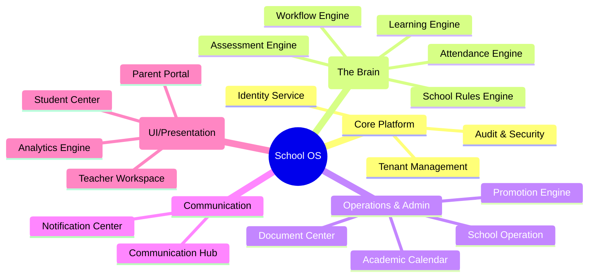
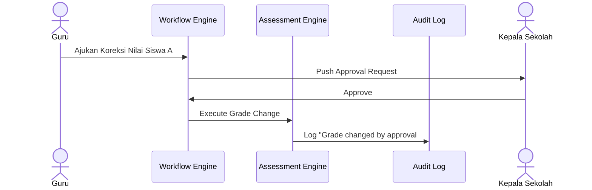
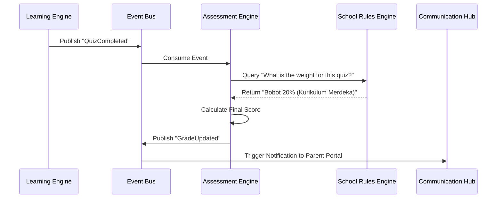
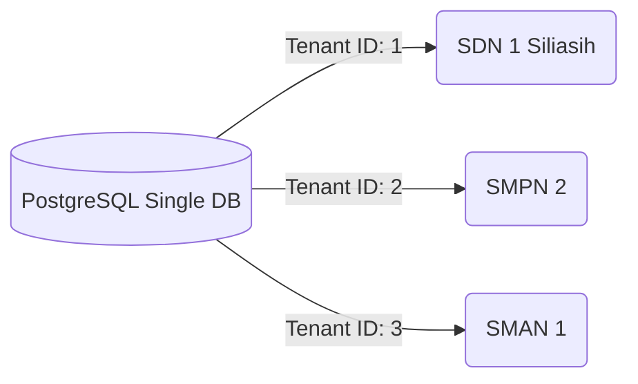

# Arsitektur School OS: Ekosistem Digital Terintegrasi

School OS adalah platform terpusat yang dirancang dengan **Domain-Driven Design (DDD)** dan **Event-Driven Architecture (EDA)**. Platform ini merepresentasikan operasi sekolah di dunia nyata, bukan sekadar formulir digital.

## 1. Top-Level Domain Architecture

Arsitektur ini menggunakan penamaan berdasarkan **Domain Pendidikan**, bukan berdasarkan antarmuka pengguna (UI).

## 2. School Rules Engine & Workflow Engine

Dua komponen pembeda utama yang menjadikan School OS sebagai platform tingkat *Enterprise*.

### School Rules Engine
Pusat kebenaran (*Single Source of Truth*) untuk seluruh regulasi akademik. Tidak ada *hardcode* KKM atau aturan kelulusan di dalam kode. Jika kurikulum berubah (misal dari K13 ke Kurikulum Merdeka), kita hanya mengubah konfigurasi di Rules Engine.
- Kurikulum & Bobot Nilai
- Syarat Kenaikan Kelas (Promotion Rules)
- KKM & Skala Penilaian

### Workflow Engine
Mengatur rantai persetujuan (*approval chain*) layaknya birokrasi nyata di sekolah namun secara digital dan transparan.

## 3. Event-Driven Interconnection (Decoupled)

Semua *Engine* berdiri secara independen. Mereka berkomunikasi melalui *Event Bus*. 

## 4. Konsep Multi-Tenant (Implementasi Skala Luas)

Sistem menggunakan *Row-Level Security (RLS)* di PostgreSQL. Semua sekolah di bawah satu dinas pendidikan bisa menggunakan sistem ini secara bersamaan tanpa kebocoran data antar sekolah.

